**Install required packages**.

``` r
#if(!require("pacman")) install.packages("pacman")
pacman::p_load(caTools,dplyr,caret,rpart,ggplot2,ROSE,DMwR,randomForest,e1071)
```

``` r
data<-read.csv("framingham.csv")#input data
data<-data[,-3]
sapply(data, function(x)sum(is.na(x)))#check for missing values
```

    ##            male             age   currentSmoker      cigsPerDay          BPMeds 
    ##               0               0               0              29              53 
    ## prevalentStroke    prevalentHyp        diabetes         totChol           sysBP 
    ##               0               0               0              50               0 
    ##           diaBP             BMI       heartRate         glucose      TenYearCHD 
    ##               0              19               1             388               0

``` r
data<-na.omit(data)
str(data)#structure of data
```

    ## 'data.frame':    3749 obs. of  15 variables:
    ##  $ male           : int  1 0 1 0 0 0 0 0 1 1 ...
    ##  $ age            : int  39 46 48 61 46 43 63 45 52 43 ...
    ##  $ currentSmoker  : int  0 0 1 1 1 0 0 1 0 1 ...
    ##  $ cigsPerDay     : int  0 0 20 30 23 0 0 20 0 30 ...
    ##  $ BPMeds         : int  0 0 0 0 0 0 0 0 0 0 ...
    ##  $ prevalentStroke: int  0 0 0 0 0 0 0 0 0 0 ...
    ##  $ prevalentHyp   : int  0 0 0 1 0 1 0 0 1 1 ...
    ##  $ diabetes       : int  0 0 0 0 0 0 0 0 0 0 ...
    ##  $ totChol        : int  195 250 245 225 285 228 205 313 260 225 ...
    ##  $ sysBP          : num  106 121 128 150 130 ...
    ##  $ diaBP          : num  70 81 80 95 84 110 71 71 89 107 ...
    ##  $ BMI            : num  27 28.7 25.3 28.6 23.1 ...
    ##  $ heartRate      : int  80 95 75 65 85 77 60 79 76 93 ...
    ##  $ glucose        : int  77 76 70 103 85 99 85 78 79 88 ...
    ##  $ TenYearCHD     : int  0 0 0 1 0 0 1 0 0 0 ...
    ##  - attr(*, "na.action")= 'omit' Named int  15 22 27 43 50 55 71 78 98 112 ...
    ##   ..- attr(*, "names")= chr  "15" "22" "27" "43" ...

``` r
data$TenYearCHD<-as.factor(data$TenYearCHD)#convert target variable to factor
```

**EDA**

``` r
data$age_group<-ifelse(data$age>=32 & data$age <42,"32-42",ifelse(data$age>=42 & data$age<49,"42-49",ifelse(data$age >= 49 & data$age <56,"49-56","above 56")))#bin age variable into 4 groups

ggplot(data = data ) + geom_bar(mapping = aes(x = as.factor(male),fill = TenYearCHD),position = "fill")+ggtitle("Gender and Age by TenYearCHD")+facet_wrap(~age_group,nrow = 2)+xlab("Gender")
```

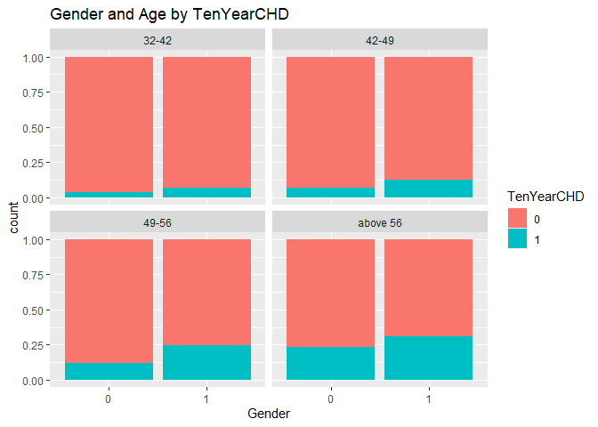<!-- -->

Males above 56 years of age are more likely to develop coronary heart
disease compared to females above
56.

``` r
ggplot(data = data ) + geom_bar(mapping = aes(x = as.factor(prevalentHyp),fill = TenYearCHD),position = "fill")+ggtitle("Prevalent hypertension and Gender by TenYearCHD")+facet_wrap(~as.factor(male))+xlab("Gender")
```

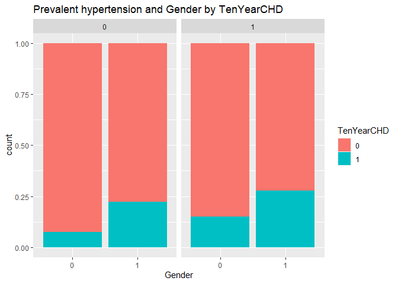<!-- -->

``` r
ggplot(data = data ) + geom_bar(mapping = aes(x = as.factor(BPMeds),fill = TenYearCHD),position = "fill")+ggtitle("BPMeds and Gender by TenYearCHD")+facet_wrap(~as.factor(male))
```

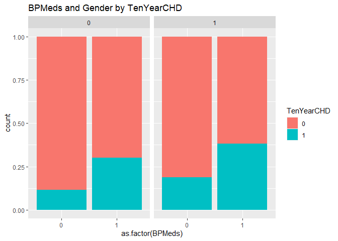<!-- -->

``` r
ggplot(data = data ) + geom_bar(mapping = aes(x = as.factor(diabetes),fill = TenYearCHD),position = "fill")+ggtitle("Diabetes and Gender by TenYearCHD")+facet_wrap(~as.factor(male))
```

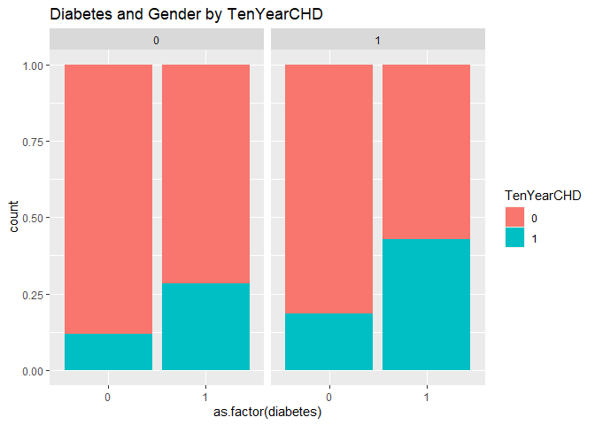<!-- -->

Males with prevalent hypertension,on Bp meds and diabetic are more
likely to develop CHD.

``` r
ggplot(data = data) + 
  geom_point(mapping = aes(x = sysBP, y = diaBP, color = TenYearCHD))+ggtitle("SysBP and diaBP scatterplot by TenYearCHD")
```

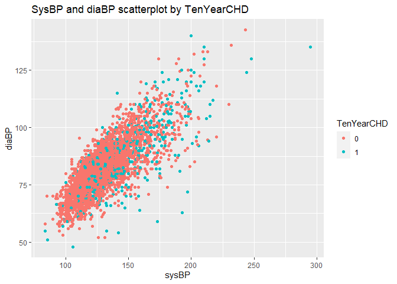<!-- -->

Higher sysBP and diaBP,higher possibility of developing CHD.

**splitting data into test and train**

``` r
set.seed(123)
split <- sample.split(data,SplitRatio = 0.8)
train.set <- subset(data,split=="TRUE")
test.set <- subset(data,split=="FALSE")
table(train.set$TenYearCHD)/nrow(train.set)*100#percentage of 0s and 1s
```

    ## 
    ##        0        1 
    ## 84.17496 15.82504

``` r
train.set<-train.set[,-16]
test.set<-test.set[,-16]
```

**Oversampling and Undersampling data**

``` r
table(train.set$TenYearCHD)
```

    ## 
    ##    0    1 
    ## 2367  445

``` r
data_over <- ovun.sample(TenYearCHD ~ ., data = train.set, method = "over",N =5000 )$data #oversampling training data
table(data_over$TenYearCHD) #proportion of 
```

    ## 
    ##    0    1 
    ## 2367 2633

``` r
data_under <- ovun.sample(TenYearCHD ~ ., data = train.set, method = "under", N = 890, seed = 1)$data #undersampling training data
table(data_under$TenYearCHD) #proportion of
```

    ## 
    ##   0   1 
    ## 445 445

``` r
data_both <- ovun.sample(TenYearCHD ~ ., data = train.set, method = "both", p=0.5,N=2945,seed = 1)$data #both under and over sampled training data      
table(data_both$TenYearCHD)
```

    ## 
    ##    0    1 
    ## 1532 1413

**SVM**

``` r
svm_tune_train <- tune(svm, TenYearCHD~.,data=train.set,ranges=list(cost=10^(-1:2), gamma=c(.5,1,2)),tunecontrol = tune.control( sampling = "cross", cross = 5))#finding the best parameters for svm model using cross validation
svm_tune_train$best.parameters
```

    ##   cost gamma
    ## 1  0.1   0.5

``` r
svm_tune_data_under <- tune(svm, TenYearCHD~.,data=data_under,ranges=list(cost=10^(-1:2), gamma=c(.5,1,2)),tunecontrol = tune.control( sampling = "cross", cross = 5))
svm_tune_data_under$best.parameters
```

    ##   cost gamma
    ## 2    1   0.5

``` r
svm_tune_data_over <- tune(svm, TenYearCHD~.,data=data_over,ranges=list(cost=10^(-1:2), gamma=c(.5,1,2)),tunecontrol = tune.control( sampling = "cross", cross = 5))
svm_tune_data_over$best.parameters
```

    ##    cost gamma
    ## 11   10     2

``` r
svm_tune_data_both <- tune(svm, TenYearCHD~.,data=data_both,ranges=list(cost=10^(-1:2), gamma=c(.5,1,2)),tunecontrol = tune.control( sampling = "cross", cross = 5))
svm_tune_data_both$best.parameters
```

    ##    cost gamma
    ## 11   10     2

``` r
svm_train<-function(x,y,z)#function to train data with SVM and validate model on training data.
{
svm_model<-svm(TenYearCHD ~ ., data=x,scaled =TRUE, cost=y, gamma=z)
pred <- predict(svm_model,x[,-15])
roc<-roc.curve(x$TenYearCHD,pred)
con<-confusionMatrix(table(pred, x$TenYearCHD))
listret<-list(roc,con)#Return confusion matrix and ROC curve
return(listret)
}

svm_test<-function(x,y,z)#function to train data with SVM and validate model on testing data
{
svm_model<-svm(TenYearCHD ~ ., data=x,scaled =TRUE, cost=y, gamma=z)
pred <- predict(svm_model,test.set[,-15])
roc<-roc.curve(test.set$TenYearCHD,pred)
con<-confusionMatrix(table(pred, test.set$TenYearCHD))
listret<-list(roc,con)#Return confusion matrix and ROC curve
return(listret)
}

svm_train(train.set,0.1,0.5)
```

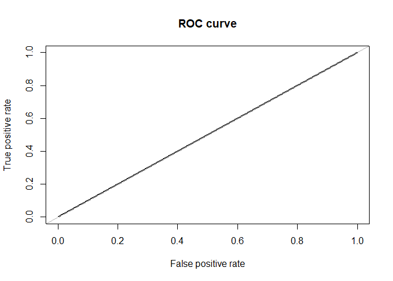<!-- -->

    ## [[1]]
    ## Area under the curve (AUC): 0.500
    ## 
    ## [[2]]
    ## Confusion Matrix and Statistics
    ## 
    ##     
    ## pred    0    1
    ##    0 2367  445
    ##    1    0    0
    ##                                           
    ##                Accuracy : 0.8417          
    ##                  95% CI : (0.8277, 0.8551)
    ##     No Information Rate : 0.8417          
    ##     P-Value [Acc > NIR] : 0.5127          
    ##                                           
    ##                   Kappa : 0               
    ##                                           
    ##  Mcnemar's Test P-Value : <2e-16          
    ##                                           
    ##             Sensitivity : 1.0000          
    ##             Specificity : 0.0000          
    ##          Pos Pred Value : 0.8417          
    ##          Neg Pred Value :    NaN          
    ##              Prevalence : 0.8417          
    ##          Detection Rate : 0.8417          
    ##    Detection Prevalence : 1.0000          
    ##       Balanced Accuracy : 0.5000          
    ##                                           
    ##        'Positive' Class : 0               
    ## 

``` r
svm_train(data_under,1,0.5)
```

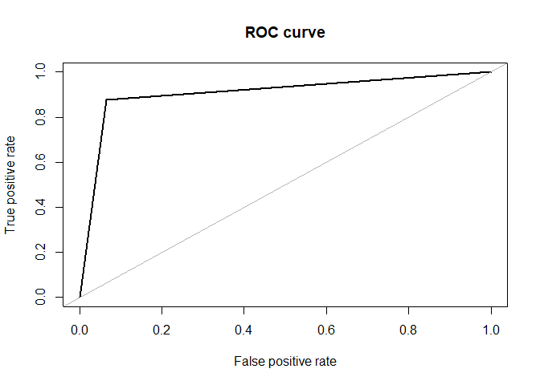<!-- -->

    ## [[1]]
    ## Area under the curve (AUC): 0.907
    ## 
    ## [[2]]
    ## Confusion Matrix and Statistics
    ## 
    ##     
    ## pred   0   1
    ##    0 416  54
    ##    1  29 391
    ##                                          
    ##                Accuracy : 0.9067         
    ##                  95% CI : (0.8857, 0.925)
    ##     No Information Rate : 0.5            
    ##     P-Value [Acc > NIR] : < 2e-16        
    ##                                          
    ##                   Kappa : 0.8135         
    ##                                          
    ##  Mcnemar's Test P-Value : 0.00843        
    ##                                          
    ##             Sensitivity : 0.9348         
    ##             Specificity : 0.8787         
    ##          Pos Pred Value : 0.8851         
    ##          Neg Pred Value : 0.9310         
    ##              Prevalence : 0.5000         
    ##          Detection Rate : 0.4674         
    ##    Detection Prevalence : 0.5281         
    ##       Balanced Accuracy : 0.9067         
    ##                                          
    ##        'Positive' Class : 0              
    ## 

``` r
svm_train(data_over,10,2)
```

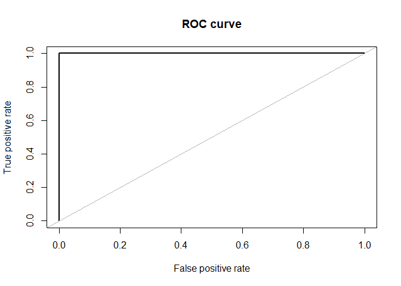<!-- -->

    ## [[1]]
    ## Area under the curve (AUC): 1.000
    ## 
    ## [[2]]
    ## Confusion Matrix and Statistics
    ## 
    ##     
    ## pred    0    1
    ##    0 2367    0
    ##    1    0 2633
    ##                                      
    ##                Accuracy : 1          
    ##                  95% CI : (0.9993, 1)
    ##     No Information Rate : 0.5266     
    ##     P-Value [Acc > NIR] : < 2.2e-16  
    ##                                      
    ##                   Kappa : 1          
    ##                                      
    ##  Mcnemar's Test P-Value : NA         
    ##                                      
    ##             Sensitivity : 1.0000     
    ##             Specificity : 1.0000     
    ##          Pos Pred Value : 1.0000     
    ##          Neg Pred Value : 1.0000     
    ##              Prevalence : 0.4734     
    ##          Detection Rate : 0.4734     
    ##    Detection Prevalence : 0.4734     
    ##       Balanced Accuracy : 1.0000     
    ##                                      
    ##        'Positive' Class : 0          
    ## 

``` r
svm_train(data_both,10,2)
```

    ## [[1]]
    ## Area under the curve (AUC): 1.000
    ## 
    ## [[2]]
    ## Confusion Matrix and Statistics
    ## 
    ##     
    ## pred    0    1
    ##    0 1532    0
    ##    1    0 1413
    ##                                      
    ##                Accuracy : 1          
    ##                  95% CI : (0.9987, 1)
    ##     No Information Rate : 0.5202     
    ##     P-Value [Acc > NIR] : < 2.2e-16  
    ##                                      
    ##                   Kappa : 1          
    ##                                      
    ##  Mcnemar's Test P-Value : NA         
    ##                                      
    ##             Sensitivity : 1.0000     
    ##             Specificity : 1.0000     
    ##          Pos Pred Value : 1.0000     
    ##          Neg Pred Value : 1.0000     
    ##              Prevalence : 0.5202     
    ##          Detection Rate : 0.5202     
    ##    Detection Prevalence : 0.5202     
    ##       Balanced Accuracy : 1.0000     
    ##                                      
    ##        'Positive' Class : 0          
    ## 

``` r
svm_test(train.set,0.1,0.5)
```

<!-- -->

    ## [[1]]
    ## Area under the curve (AUC): 0.500
    ## 
    ## [[2]]
    ## Confusion Matrix and Statistics
    ## 
    ##     
    ## pred   0   1
    ##    0 810 127
    ##    1   0   0
    ##                                           
    ##                Accuracy : 0.8645          
    ##                  95% CI : (0.8409, 0.8857)
    ##     No Information Rate : 0.8645          
    ##     P-Value [Acc > NIR] : 0.5236          
    ##                                           
    ##                   Kappa : 0               
    ##                                           
    ##  Mcnemar's Test P-Value : <2e-16          
    ##                                           
    ##             Sensitivity : 1.0000          
    ##             Specificity : 0.0000          
    ##          Pos Pred Value : 0.8645          
    ##          Neg Pred Value :    NaN          
    ##              Prevalence : 0.8645          
    ##          Detection Rate : 0.8645          
    ##    Detection Prevalence : 1.0000          
    ##       Balanced Accuracy : 0.5000          
    ##                                           
    ##        'Positive' Class : 0               
    ## 

``` r
svm_test(data_under,1,0.5)
```

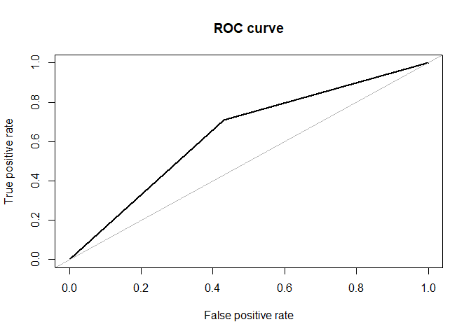<!-- -->

    ## [[1]]
    ## Area under the curve (AUC): 0.640
    ## 
    ## [[2]]
    ## Confusion Matrix and Statistics
    ## 
    ##     
    ## pred   0   1
    ##    0 462  37
    ##    1 348  90
    ##                                           
    ##                Accuracy : 0.5891          
    ##                  95% CI : (0.5568, 0.6208)
    ##     No Information Rate : 0.8645          
    ##     P-Value [Acc > NIR] : 1               
    ##                                           
    ##                   Kappa : 0.1373          
    ##                                           
    ##  Mcnemar's Test P-Value : <2e-16          
    ##                                           
    ##             Sensitivity : 0.5704          
    ##             Specificity : 0.7087          
    ##          Pos Pred Value : 0.9259          
    ##          Neg Pred Value : 0.2055          
    ##              Prevalence : 0.8645          
    ##          Detection Rate : 0.4931          
    ##    Detection Prevalence : 0.5326          
    ##       Balanced Accuracy : 0.6395          
    ##                                           
    ##        'Positive' Class : 0               
    ## 

``` r
svm_test(data_over,10,2)
```

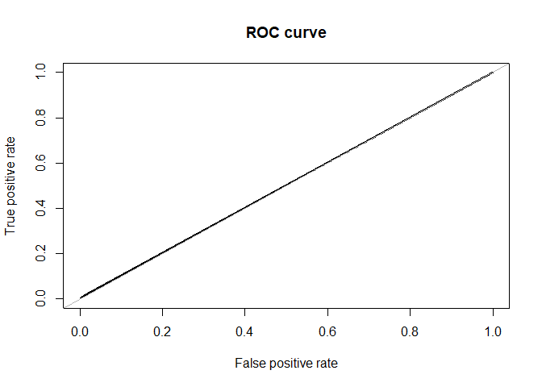<!-- -->

    ## [[1]]
    ## Area under the curve (AUC): 0.503
    ## 
    ## [[2]]
    ## Confusion Matrix and Statistics
    ## 
    ##     
    ## pred   0   1
    ##    0 802 125
    ##    1   8   2
    ##                                           
    ##                Accuracy : 0.8581          
    ##                  95% CI : (0.8341, 0.8798)
    ##     No Information Rate : 0.8645          
    ##     P-Value [Acc > NIR] : 0.7348          
    ##                                           
    ##                   Kappa : 0.0096          
    ##                                           
    ##  Mcnemar's Test P-Value : <2e-16          
    ##                                           
    ##             Sensitivity : 0.99012         
    ##             Specificity : 0.01575         
    ##          Pos Pred Value : 0.86516         
    ##          Neg Pred Value : 0.20000         
    ##              Prevalence : 0.86446         
    ##          Detection Rate : 0.85592         
    ##    Detection Prevalence : 0.98933         
    ##       Balanced Accuracy : 0.50294         
    ##                                           
    ##        'Positive' Class : 0               
    ## 

``` r
svm_test(data_both,10,2)
```

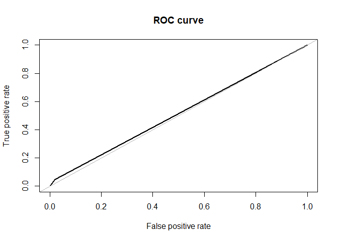<!-- -->

    ## [[1]]
    ## Area under the curve (AUC): 0.514
    ## 
    ## [[2]]
    ## Confusion Matrix and Statistics
    ## 
    ##     
    ## pred   0   1
    ##    0 794 121
    ##    1  16   6
    ##                                           
    ##                Accuracy : 0.8538          
    ##                  95% CI : (0.8295, 0.8758)
    ##     No Information Rate : 0.8645          
    ##     P-Value [Acc > NIR] : 0.8419          
    ##                                           
    ##                   Kappa : 0.0422          
    ##                                           
    ##  Mcnemar's Test P-Value : <2e-16          
    ##                                           
    ##             Sensitivity : 0.98025         
    ##             Specificity : 0.04724         
    ##          Pos Pred Value : 0.86776         
    ##          Neg Pred Value : 0.27273         
    ##              Prevalence : 0.86446         
    ##          Detection Rate : 0.84739         
    ##    Detection Prevalence : 0.97652         
    ##       Balanced Accuracy : 0.51375         
    ##                                           
    ##        'Positive' Class : 0               
    ## 

The support vector machine classification model is build using Radial
Basis Function (RBF) kernel. Cross validation and grid search methods
are applied in analysing the best parameter values for SVM model. The
best SVM model is the model build on under sampled dataset with
parameters C =1 and gamma = 0.5 respectively. The model has test
accuracy of 59%. Sensitivity of the model is 57% and specificity of the
model is 79%.AUC is 64%.

**Logistic
regression**

``` r
train.set$age<-ifelse(train.set$age>=32 & train.set$age <42,"32-42",ifelse(train.set$age>=42 & train.set$age<49,"42-49",ifelse(train.set$age >= 49 & train.set$age <56,"49-56","above 56")))#bin age variable into 4 groups
test.set$age<-ifelse(test.set$age>=32 & test.set$age <42,"32-42",ifelse(test.set$age>=42 & test.set$age<49,"42-49",ifelse(test.set$age >= 49 & test.set$age <56,"49-56","above 56")))
data_under$age<-ifelse(data_under$age>=32 & data_under$age <42,"32-42",ifelse(data_under$age>=42 & data_under$age<49,"42-49",ifelse(data_under$age >= 49 & data_under$age <56,"49-56","above 56")))
data_over$age<-ifelse(data_over$age>=32 & data_over$age <42,"32-42",ifelse(data_over$age>=42 & data_over$age<49,"42-49",ifelse(data_over$age >= 49 & data_over$age <56,"49-56","above 56")))
data_both$age<-ifelse(data_both$age>=32 & data_both$age <42,"32-42",ifelse(data_both$age>=42 & data_both$age<49,"42-49",ifelse(data_both$age >= 49 & data_both$age <56,"49-56","above 56")))
train.set[,c(1,2,3,5,6,7,8)] <- as.data.frame(sapply(train.set[,c(1,2,3,5,6,7,8)] , factor))
test.set[,c(1,2,3,5,6,7,8)] <- as.data.frame(sapply(test.set[,c(1,2,3,5,6,7,8)] , factor))
data_under[,c(1,2,3,5,6,7,8)] <- as.data.frame(sapply(data_under[,c(1,2,3,5,6,7,8)] , factor))
data_over[,c(1,2,3,5,6,7,8)] <- as.data.frame(sapply(data_over[,c(1,2,3,5,6,7,8)] , factor))
data_both[,c(1,2,3,5,6,7,8)] <- as.data.frame(sapply(data_both[,c(1,2,3,5,6,7,8)] , factor))


log_reg_train<-function(x)#function to train data with logistic regression and validate model on training data
{
log_reg<-glm(TenYearCHD ~ male + age + sysBP + glucose + cigsPerDay + 
    heartRate + prevalentHyp, family = "binomial", data = x)
logit.step.pred <- predict(log_reg, x[,-15], type = "response")
logit.step.pred[logit.step.pred > 0.5]="1"
logit.step.pred[logit.step.pred <= 0.5]="0"
logit.step.pred<-as.factor(logit.step.pred)
roc<-roc.curve(x$TenYearCHD,logit.step.pred)
con<-confusionMatrix(table(x$TenYearCHD,logit.step.pred))
listret<-list(roc,con)#Return confusion matrix and ROC curve
return(listret)

}

log_reg_test<-function(x)#function to train data with logistic regression and validate model on testing data
{
log_reg<-glm(TenYearCHD ~ male + age + sysBP + glucose + cigsPerDay + 
    heartRate + prevalentHyp, family = "binomial", data = x)
logit.step.pred <- predict(log_reg, test.set[,-15], type = "response")
logit.step.pred[logit.step.pred > 0.5]="1"
logit.step.pred[logit.step.pred <= 0.5]="0"
logit.step.pred<-as.factor(logit.step.pred)
roc<-roc.curve(test.set$TenYearCHD,logit.step.pred)
con<-confusionMatrix(table(test.set$TenYearCHD,logit.step.pred))
listret<-list(roc,con)#Return confusion matrix and ROC curve
return(listret)
}

log_reg_train(train.set)
```

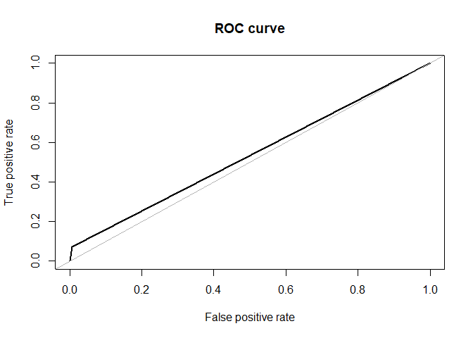<!-- -->

    ## [[1]]
    ## Area under the curve (AUC): 0.534
    ## 
    ## [[2]]
    ## Confusion Matrix and Statistics
    ## 
    ##    logit.step.pred
    ##        0    1
    ##   0 2352   15
    ##   1  412   33
    ##                                           
    ##                Accuracy : 0.8482          
    ##                  95% CI : (0.8343, 0.8612)
    ##     No Information Rate : 0.9829          
    ##     P-Value [Acc > NIR] : 1               
    ##                                           
    ##                   Kappa : 0.1063          
    ##                                           
    ##  Mcnemar's Test P-Value : <2e-16          
    ##                                           
    ##             Sensitivity : 0.85094         
    ##             Specificity : 0.68750         
    ##          Pos Pred Value : 0.99366         
    ##          Neg Pred Value : 0.07416         
    ##              Prevalence : 0.98293         
    ##          Detection Rate : 0.83642         
    ##    Detection Prevalence : 0.84175         
    ##       Balanced Accuracy : 0.76922         
    ##                                           
    ##        'Positive' Class : 0               
    ## 

``` r
log_reg_train(data_under)
```

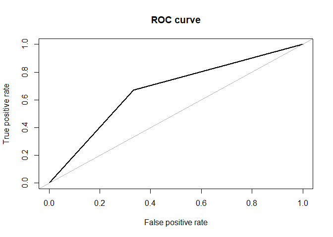<!-- -->

    ## [[1]]
    ## Area under the curve (AUC): 0.670
    ## 
    ## [[2]]
    ## Confusion Matrix and Statistics
    ## 
    ##    logit.step.pred
    ##       0   1
    ##   0 297 148
    ##   1 146 299
    ##                                           
    ##                Accuracy : 0.6697          
    ##                  95% CI : (0.6377, 0.7005)
    ##     No Information Rate : 0.5022          
    ##     P-Value [Acc > NIR] : <2e-16          
    ##                                           
    ##                   Kappa : 0.3393          
    ##                                           
    ##  Mcnemar's Test P-Value : 0.9535          
    ##                                           
    ##             Sensitivity : 0.6704          
    ##             Specificity : 0.6689          
    ##          Pos Pred Value : 0.6674          
    ##          Neg Pred Value : 0.6719          
    ##              Prevalence : 0.4978          
    ##          Detection Rate : 0.3337          
    ##    Detection Prevalence : 0.5000          
    ##       Balanced Accuracy : 0.6697          
    ##                                           
    ##        'Positive' Class : 0               
    ## 

``` r
log_reg_train(data_over)
```

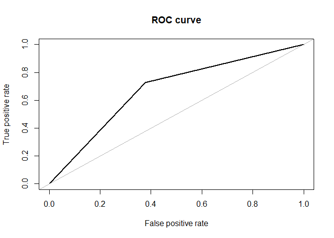<!-- -->

    ## [[1]]
    ## Area under the curve (AUC): 0.674
    ## 
    ## [[2]]
    ## Confusion Matrix and Statistics
    ## 
    ##    logit.step.pred
    ##        0    1
    ##   0 1475  892
    ##   1  722 1911
    ##                                          
    ##                Accuracy : 0.6772         
    ##                  95% CI : (0.664, 0.6902)
    ##     No Information Rate : 0.5606         
    ##     P-Value [Acc > NIR] : < 2.2e-16      
    ##                                          
    ##                   Kappa : 0.3502         
    ##                                          
    ##  Mcnemar's Test P-Value : 2.592e-05      
    ##                                          
    ##             Sensitivity : 0.6714         
    ##             Specificity : 0.6818         
    ##          Pos Pred Value : 0.6232         
    ##          Neg Pred Value : 0.7258         
    ##              Prevalence : 0.4394         
    ##          Detection Rate : 0.2950         
    ##    Detection Prevalence : 0.4734         
    ##       Balanced Accuracy : 0.6766         
    ##                                          
    ##        'Positive' Class : 0              
    ## 

``` r
log_reg_train(data_both)
```

<!-- -->

    ## [[1]]
    ## Area under the curve (AUC): 0.669
    ## 
    ## [[2]]
    ## Confusion Matrix and Statistics
    ## 
    ##    logit.step.pred
    ##        0    1
    ##   0 1072  460
    ##   1  511  902
    ##                                          
    ##                Accuracy : 0.6703         
    ##                  95% CI : (0.653, 0.6873)
    ##     No Information Rate : 0.5375         
    ##     P-Value [Acc > NIR] : <2e-16         
    ##                                          
    ##                   Kappa : 0.3386         
    ##                                          
    ##  Mcnemar's Test P-Value : 0.1086         
    ##                                          
    ##             Sensitivity : 0.6772         
    ##             Specificity : 0.6623         
    ##          Pos Pred Value : 0.6997         
    ##          Neg Pred Value : 0.6384         
    ##              Prevalence : 0.5375         
    ##          Detection Rate : 0.3640         
    ##    Detection Prevalence : 0.5202         
    ##       Balanced Accuracy : 0.6697         
    ##                                          
    ##        'Positive' Class : 0              
    ## 

``` r
log_reg_test(train.set)
```

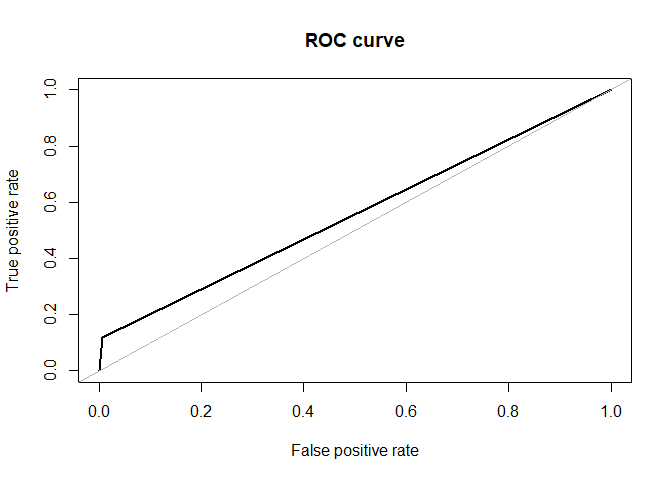<!-- -->

    ## [[1]]
    ## Area under the curve (AUC): 0.555
    ## 
    ## [[2]]
    ## Confusion Matrix and Statistics
    ## 
    ##    logit.step.pred
    ##       0   1
    ##   0 804   6
    ##   1 112  15
    ##                                           
    ##                Accuracy : 0.8741          
    ##                  95% CI : (0.8511, 0.8946)
    ##     No Information Rate : 0.9776          
    ##     P-Value [Acc > NIR] : 1               
    ##                                           
    ##                   Kappa : 0.1708          
    ##                                           
    ##  Mcnemar's Test P-Value : <2e-16          
    ##                                           
    ##             Sensitivity : 0.8777          
    ##             Specificity : 0.7143          
    ##          Pos Pred Value : 0.9926          
    ##          Neg Pred Value : 0.1181          
    ##              Prevalence : 0.9776          
    ##          Detection Rate : 0.8581          
    ##    Detection Prevalence : 0.8645          
    ##       Balanced Accuracy : 0.7960          
    ##                                           
    ##        'Positive' Class : 0               
    ## 

``` r
log_reg_test(data_under)
```

<!-- -->

    ## [[1]]
    ## Area under the curve (AUC): 0.654
    ## 
    ## [[2]]
    ## Confusion Matrix and Statistics
    ## 
    ##    logit.step.pred
    ##       0   1
    ##   0 511 299
    ##   1  41  86
    ##                                          
    ##                Accuracy : 0.6371         
    ##                  95% CI : (0.6054, 0.668)
    ##     No Information Rate : 0.5891         
    ##     P-Value [Acc > NIR] : 0.001477       
    ##                                          
    ##                   Kappa : 0.1659         
    ##                                          
    ##  Mcnemar's Test P-Value : < 2.2e-16      
    ##                                          
    ##             Sensitivity : 0.9257         
    ##             Specificity : 0.2234         
    ##          Pos Pred Value : 0.6309         
    ##          Neg Pred Value : 0.6772         
    ##              Prevalence : 0.5891         
    ##          Detection Rate : 0.5454         
    ##    Detection Prevalence : 0.8645         
    ##       Balanced Accuracy : 0.5746         
    ##                                          
    ##        'Positive' Class : 0              
    ## 

``` r
log_reg_test(data_over)
```

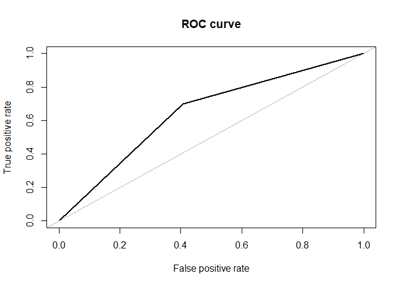<!-- -->

    ## [[1]]
    ## Area under the curve (AUC): 0.647
    ## 
    ## [[2]]
    ## Confusion Matrix and Statistics
    ## 
    ##    logit.step.pred
    ##       0   1
    ##   0 480 330
    ##   1  38  89
    ##                                           
    ##                Accuracy : 0.6073          
    ##                  95% CI : (0.5752, 0.6387)
    ##     No Information Rate : 0.5528          
    ##     P-Value [Acc > NIR] : 0.0004298       
    ##                                           
    ##                   Kappa : 0.149           
    ##                                           
    ##  Mcnemar's Test P-Value : < 2.2e-16       
    ##                                           
    ##             Sensitivity : 0.9266          
    ##             Specificity : 0.2124          
    ##          Pos Pred Value : 0.5926          
    ##          Neg Pred Value : 0.7008          
    ##              Prevalence : 0.5528          
    ##          Detection Rate : 0.5123          
    ##    Detection Prevalence : 0.8645          
    ##       Balanced Accuracy : 0.5695          
    ##                                           
    ##        'Positive' Class : 0               
    ## 

``` r
log_reg_test(data_both)
```

<!-- -->

    ## [[1]]
    ## Area under the curve (AUC): 0.647
    ## 
    ## [[2]]
    ## Confusion Matrix and Statistics
    ## 
    ##    logit.step.pred
    ##       0   1
    ##   0 551 259
    ##   1  49  78
    ##                                           
    ##                Accuracy : 0.6713          
    ##                  95% CI : (0.6402, 0.7013)
    ##     No Information Rate : 0.6403          
    ##     P-Value [Acc > NIR] : 0.02561         
    ##                                           
    ##                   Kappa : 0.1735          
    ##                                           
    ##  Mcnemar's Test P-Value : < 2e-16         
    ##                                           
    ##             Sensitivity : 0.9183          
    ##             Specificity : 0.2315          
    ##          Pos Pred Value : 0.6802          
    ##          Neg Pred Value : 0.6142          
    ##              Prevalence : 0.6403          
    ##          Detection Rate : 0.5880          
    ##    Detection Prevalence : 0.8645          
    ##       Balanced Accuracy : 0.5749          
    ##                                           
    ##        'Positive' Class : 0               
    ## 

The logistic regression model is built using the best predictors. The
best subset of predictors is selected using step wise selection with AIC
criterion. The best predictors are male, age, sysBP, glucose,
cigsPerDay, heartrate and prevalentHyp. The best logistic regression
model is the model built on the training dataset as it is with test
accuracy of 87%. Sensitivity of the model is 87% and specificity of the
model is 71%.AUC is 53%.  
Logistic regression equation:  
TenYearCHD \~ (0.47) male + (0.07) age +(0.013) sysBP +(0.01) glucose
+(0.017) cigsPerDay -(0.009) heartRate + (0.24) prevalentHyp  
Interpreting the results:  
• The odds of getting diagnosed with CHD for males over that of females
is exp (0.47) = 1.5999. In terms of percent change, we can say that the
odds for males are 60% higher than the odds for females.  
• The coefficient for age says that, holding all others constant, we
will see 7% increase in the odds of getting diagnosed with CHD for a
one-year increase in age since exp (0.07) = 1.0725.  
• With every extra cigarette one smokes there is a 2% increase in the
odds of CDH since exp (0.017) =1.02.

**Feature engineering for naive bayes and random forest model**

``` r
data_fact<-read.csv("framingham.csv")
data_fact<-data_fact[,-c(3,4)]
data_fact<-na.omit(data_fact)

quantile(data$age, probs = seq(0, 1, 0.25), na.rm = TRUE)
```

    ##   0%  25%  50%  75% 100% 
    ##   32   42   49   56   70

``` r
data_fact$age<-ifelse(data_fact$age>=32 & data_fact$age <42,"32-42",ifelse(data_fact$age>=42 & data_fact$age<49,"42-49",ifelse(data_fact$age >= 49 & data_fact$age <56,"49-56","above 56")))

data_fact$cigsPerDay<-ifelse(data_fact$cigsPerDay==0,"None",ifelse(data_fact$cigsPerDay>20,"High",ifelse(data_fact$cigsPerDay >0 & data_fact$cigsPerDay <= 10,"Low","Medium")))

data_fact$totChol<-ifelse(data_fact$totChol>240,"High",ifelse(data_fact$diaBP<200,"low","Boderline High"))
data_fact$sysBP<-ifelse(data_fact$sysBP>180,"High",ifelse(data_fact$sysBP<140,"low","Boderline High"))
data_fact$diaBP<-ifelse(data_fact$diaBP>120,"High",ifelse(data_fact$diaBP<80,"low","Boderline High"))

data_fact$BMI<-ifelse(data_fact$BMI>30,"Obese",ifelse(data_fact$BMI<18.5,"Underweight",ifelse(data_fact$BMI >= 18.5 & data_fact$BMI <= 24.9,"Healthy","Overweight")))

data_fact$heartRate<-ifelse(data_fact$heartRate>100,"High",ifelse(data_fact$heartRate<60,"low","Normal"))
data_fact$glucose<-ifelse(data_fact$glucose>125,"Diabetic",ifelse(data_fact$glucose<100,"Normal","Pre-Diabetic"))
col_names <- names(data_fact)
data_fact[,col_names] <- lapply(data_fact[,col_names] , factor)


set.seed(123)
split <- sample.split(data_fact,SplitRatio = 0.8)
train.set <- subset(data_fact,split=="TRUE")
test.set <- subset(data_fact,split=="FALSE")

#undersampling and oversampling

table(train.set$TenYearCHD)
```

    ## 
    ##    0    1 
    ## 2500  445

``` r
data_over <- ovun.sample(TenYearCHD ~ ., data = train.set, method = "over",N =5000 )$data #oversampling training data
table(data_over$TenYearCHD) #proportion of TenYearCHD
```

    ## 
    ##    0    1 
    ## 2500 2500

``` r
data_under <- ovun.sample(TenYearCHD ~ ., data = train.set, method = "under", N = 890, seed = 1)$data #undersampling training data
table(data_under$TenYearCHD) #proportion of TenYearCHD
```

    ## 
    ##   0   1 
    ## 445 445

``` r
data_both <- ovun.sample(TenYearCHD ~ ., data = train.set, method = "both", p=0.5,N=2945,seed = 1)$data #both under and over sampled training data      
table(data_both$TenYearCHD)
```

    ## 
    ##    0    1 
    ## 1532 1413

**Naive
Bayes**

``` r
NV_train<-function(x)#function to train data with Naive Bayes and validate model on training data
{
NV_model<-naiveBayes(TenYearCHD ~ .,data=x)
pred.class <- predict(NV_model,x[,-14])
roc<-roc.curve(x$TenYearCHD,pred.class)
con<-confusionMatrix(table(x$TenYearCHD,pred.class))
listret<-list(roc,con)#Return confusion matrix and ROC curve
return(listret)
}

NV_test<-function(x)#function to train data with Naive Bayes and validate model on testing data
{
NV_model<-naiveBayes(TenYearCHD ~ .,data=x)
pred.class <- predict(NV_model,test.set[,-14])
roc<-roc.curve(test.set$TenYearCHD,pred.class)
con<-confusionMatrix(table(test.set$TenYearCHD,pred.class))
listret<-list(roc,con)#Return confusion matrix and ROC curve
return(listret)
}

NV_train(train.set)
```

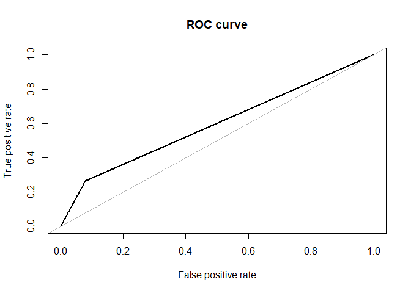<!-- -->

    ## [[1]]
    ## Area under the curve (AUC): 0.592
    ## 
    ## [[2]]
    ## Confusion Matrix and Statistics
    ## 
    ##    pred.class
    ##        0    1
    ##   0 2301  199
    ##   1  328  117
    ##                                           
    ##                Accuracy : 0.8211          
    ##                  95% CI : (0.8067, 0.8347)
    ##     No Information Rate : 0.8927          
    ##     P-Value [Acc > NIR] : 1               
    ##                                           
    ##                   Kappa : 0.2081          
    ##                                           
    ##  Mcnemar's Test P-Value : 2.464e-08       
    ##                                           
    ##             Sensitivity : 0.8752          
    ##             Specificity : 0.3703          
    ##          Pos Pred Value : 0.9204          
    ##          Neg Pred Value : 0.2629          
    ##              Prevalence : 0.8927          
    ##          Detection Rate : 0.7813          
    ##    Detection Prevalence : 0.8489          
    ##       Balanced Accuracy : 0.6227          
    ##                                           
    ##        'Positive' Class : 0               
    ## 

``` r
NV_train(data_over)
```

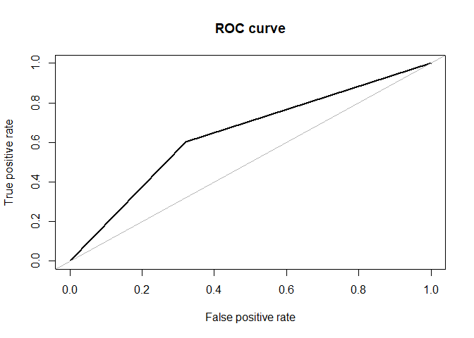<!-- -->

    ## [[1]]
    ## Area under the curve (AUC): 0.640
    ## 
    ## [[2]]
    ## Confusion Matrix and Statistics
    ## 
    ##    pred.class
    ##        0    1
    ##   0 1696  804
    ##   1  994 1506
    ##                                           
    ##                Accuracy : 0.6404          
    ##                  95% CI : (0.6269, 0.6537)
    ##     No Information Rate : 0.538           
    ##     P-Value [Acc > NIR] : < 2.2e-16       
    ##                                           
    ##                   Kappa : 0.2808          
    ##                                           
    ##  Mcnemar's Test P-Value : 8.302e-06       
    ##                                           
    ##             Sensitivity : 0.6305          
    ##             Specificity : 0.6519          
    ##          Pos Pred Value : 0.6784          
    ##          Neg Pred Value : 0.6024          
    ##              Prevalence : 0.5380          
    ##          Detection Rate : 0.3392          
    ##    Detection Prevalence : 0.5000          
    ##       Balanced Accuracy : 0.6412          
    ##                                           
    ##        'Positive' Class : 0               
    ## 

``` r
NV_train(data_both)
```

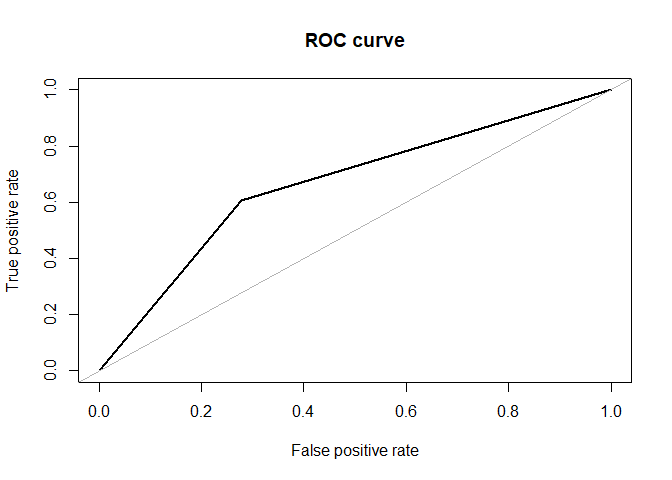<!-- -->

    ## [[1]]
    ## Area under the curve (AUC): 0.663
    ## 
    ## [[2]]
    ## Confusion Matrix and Statistics
    ## 
    ##    pred.class
    ##        0    1
    ##   0 1105  427
    ##   1  558  855
    ##                                           
    ##                Accuracy : 0.6655          
    ##                  95% CI : (0.6482, 0.6826)
    ##     No Information Rate : 0.5647          
    ##     P-Value [Acc > NIR] : < 2.2e-16       
    ##                                           
    ##                   Kappa : 0.3276          
    ##                                           
    ##  Mcnemar's Test P-Value : 3.441e-05       
    ##                                           
    ##             Sensitivity : 0.6645          
    ##             Specificity : 0.6669          
    ##          Pos Pred Value : 0.7213          
    ##          Neg Pred Value : 0.6051          
    ##              Prevalence : 0.5647          
    ##          Detection Rate : 0.3752          
    ##    Detection Prevalence : 0.5202          
    ##       Balanced Accuracy : 0.6657          
    ##                                           
    ##        'Positive' Class : 0               
    ## 

``` r
NV_train(data_under)
```

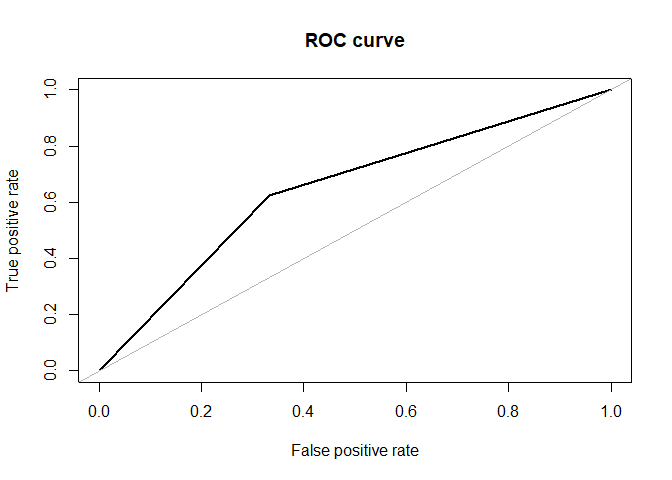<!-- -->

    ## [[1]]
    ## Area under the curve (AUC): 0.646
    ## 
    ## [[2]]
    ## Confusion Matrix and Statistics
    ## 
    ##    pred.class
    ##       0   1
    ##   0 297 148
    ##   1 167 278
    ##                                           
    ##                Accuracy : 0.6461          
    ##                  95% CI : (0.6136, 0.6775)
    ##     No Information Rate : 0.5213          
    ##     P-Value [Acc > NIR] : 3.718e-14       
    ##                                           
    ##                   Kappa : 0.2921          
    ##                                           
    ##  Mcnemar's Test P-Value : 0.3105          
    ##                                           
    ##             Sensitivity : 0.6401          
    ##             Specificity : 0.6526          
    ##          Pos Pred Value : 0.6674          
    ##          Neg Pred Value : 0.6247          
    ##              Prevalence : 0.5213          
    ##          Detection Rate : 0.3337          
    ##    Detection Prevalence : 0.5000          
    ##       Balanced Accuracy : 0.6463          
    ##                                           
    ##        'Positive' Class : 0               
    ## 

``` r
NV_test(train.set)
```

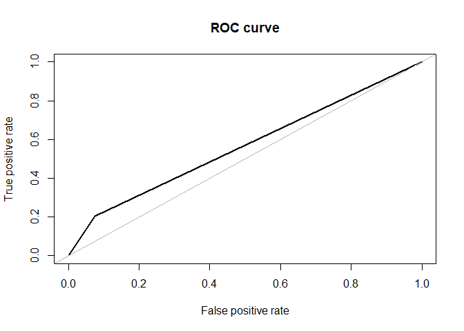<!-- -->

    ## [[1]]
    ## Area under the curve (AUC): 0.565
    ## 
    ## [[2]]
    ## Confusion Matrix and Statistics
    ## 
    ##    pred.class
    ##       0   1
    ##   0 627  50
    ##   1 101  26
    ##                                           
    ##                Accuracy : 0.8122          
    ##                  95% CI : (0.7834, 0.8386)
    ##     No Information Rate : 0.9055          
    ##     P-Value [Acc > NIR] : 1               
    ##                                           
    ##                   Kappa : 0.1564          
    ##                                           
    ##  Mcnemar's Test P-Value : 4.723e-05       
    ##                                           
    ##             Sensitivity : 0.8613          
    ##             Specificity : 0.3421          
    ##          Pos Pred Value : 0.9261          
    ##          Neg Pred Value : 0.2047          
    ##              Prevalence : 0.9055          
    ##          Detection Rate : 0.7799          
    ##    Detection Prevalence : 0.8420          
    ##       Balanced Accuracy : 0.6017          
    ##                                           
    ##        'Positive' Class : 0               
    ## 

``` r
NV_test(data_over)
```

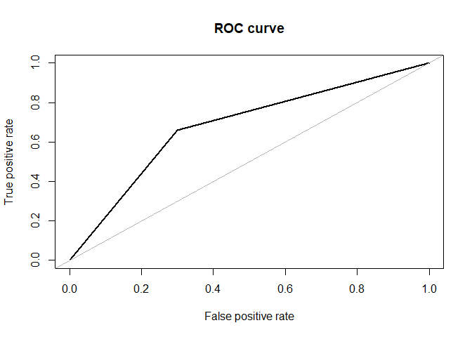<!-- -->

    ## [[1]]
    ## Area under the curve (AUC): 0.681
    ## 
    ## [[2]]
    ## Confusion Matrix and Statistics
    ## 
    ##    pred.class
    ##       0   1
    ##   0 474 203
    ##   1  43  84
    ##                                           
    ##                Accuracy : 0.694           
    ##                  95% CI : (0.6609, 0.7257)
    ##     No Information Rate : 0.643           
    ##     P-Value [Acc > NIR] : 0.001296        
    ##                                           
    ##                   Kappa : 0.2392          
    ##                                           
    ##  Mcnemar's Test P-Value : < 2.2e-16       
    ##                                           
    ##             Sensitivity : 0.9168          
    ##             Specificity : 0.2927          
    ##          Pos Pred Value : 0.7001          
    ##          Neg Pred Value : 0.6614          
    ##              Prevalence : 0.6430          
    ##          Detection Rate : 0.5896          
    ##    Detection Prevalence : 0.8420          
    ##       Balanced Accuracy : 0.6048          
    ##                                           
    ##        'Positive' Class : 0               
    ## 

``` r
NV_test(data_both)
```

<!-- -->

    ## [[1]]
    ## Area under the curve (AUC): 0.689
    ## 
    ## [[2]]
    ## Confusion Matrix and Statistics
    ## 
    ##    pred.class
    ##       0   1
    ##   0 491 186
    ##   1  44  83
    ##                                          
    ##                Accuracy : 0.7139         
    ##                  95% CI : (0.6813, 0.745)
    ##     No Information Rate : 0.6654         
    ##     P-Value [Acc > NIR] : 0.001801       
    ##                                          
    ##                   Kappa : 0.2605         
    ##                                          
    ##  Mcnemar's Test P-Value : < 2.2e-16      
    ##                                          
    ##             Sensitivity : 0.9178         
    ##             Specificity : 0.3086         
    ##          Pos Pred Value : 0.7253         
    ##          Neg Pred Value : 0.6535         
    ##              Prevalence : 0.6654         
    ##          Detection Rate : 0.6107         
    ##    Detection Prevalence : 0.8420         
    ##       Balanced Accuracy : 0.6132         
    ##                                          
    ##        'Positive' Class : 0              
    ## 

``` r
NV_test(data_under)
```

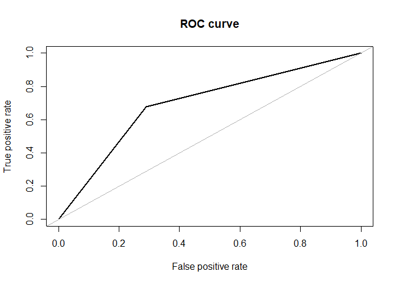<!-- -->

    ## [[1]]
    ## Area under the curve (AUC): 0.694
    ## 
    ## [[2]]
    ## Confusion Matrix and Statistics
    ## 
    ##    pred.class
    ##       0   1
    ##   0 481 196
    ##   1  41  86
    ##                                           
    ##                Accuracy : 0.7052          
    ##                  95% CI : (0.6724, 0.7366)
    ##     No Information Rate : 0.6493          
    ##     P-Value [Acc > NIR] : 0.0004347       
    ##                                           
    ##                   Kappa : 0.2592          
    ##                                           
    ##  Mcnemar's Test P-Value : < 2.2e-16       
    ##                                           
    ##             Sensitivity : 0.9215          
    ##             Specificity : 0.3050          
    ##          Pos Pred Value : 0.7105          
    ##          Neg Pred Value : 0.6772          
    ##              Prevalence : 0.6493          
    ##          Detection Rate : 0.5983          
    ##    Detection Prevalence : 0.8420          
    ##       Balanced Accuracy : 0.6132          
    ##                                           
    ##        'Positive' Class : 0               
    ## 

The best Naïve Bayes model is the model built the training dataset as it
is with test accuracy of 81%. Sensitivity of the model is 86% and
specificity of the model is 34%.AUC is 56%.

**Random Forest
Models**

``` r
rf_train<-function(x)#function to train data with Random Forest and validate model on training data.
{
rf = randomForest(TenYearCHD~.,ntree = 1000,data = x)
rf.pred.tree<-predict(rf, newdata = x[,-14],type="class")
roc<-roc.curve(x$TenYearCHD,rf.pred.tree)
con<-confusionMatrix(table(rf.pred.tree,x$TenYearCHD))
listret<-list(roc,con)#Return confusion matrix and ROC curve
return(listret)
}

rf_test<-function(x)#function to train data with Random Forest and validate model on testing data.
{
rf = randomForest(TenYearCHD~.,ntree = 1000,data = x)
rf.pred.tree<-predict(rf, newdata = test.set[,-14],type="class")
roc<-roc.curve(test.set$TenYearCHD,rf.pred.tree)
con<-confusionMatrix(table(rf.pred.tree,test.set$TenYearCHD))
listret<-list(roc,con)#Return confusion matrix and ROC curve
return(listret)
}

rf_train(train.set)
```

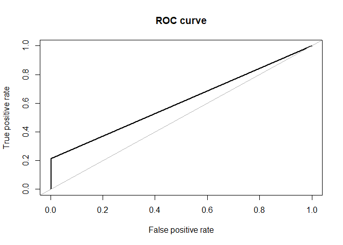<!-- -->

    ## [[1]]
    ## Area under the curve (AUC): 0.606
    ## 
    ## [[2]]
    ## Confusion Matrix and Statistics
    ## 
    ##             
    ## rf.pred.tree    0    1
    ##            0 2495  350
    ##            1    5   95
    ##                                          
    ##                Accuracy : 0.8795         
    ##                  95% CI : (0.8671, 0.891)
    ##     No Information Rate : 0.8489         
    ##     P-Value [Acc > NIR] : 1.077e-06      
    ##                                          
    ##                   Kappa : 0.3104         
    ##                                          
    ##  Mcnemar's Test P-Value : < 2.2e-16      
    ##                                          
    ##             Sensitivity : 0.9980         
    ##             Specificity : 0.2135         
    ##          Pos Pred Value : 0.8770         
    ##          Neg Pred Value : 0.9500         
    ##              Prevalence : 0.8489         
    ##          Detection Rate : 0.8472         
    ##    Detection Prevalence : 0.9660         
    ##       Balanced Accuracy : 0.6057         
    ##                                          
    ##        'Positive' Class : 0              
    ## 

``` r
rf_train(data_over)
```

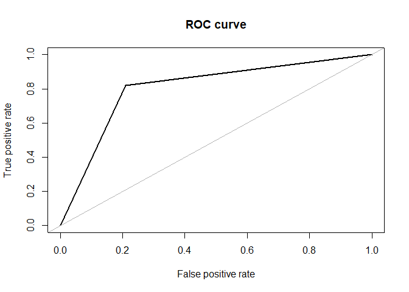<!-- -->

    ## [[1]]
    ## Area under the curve (AUC): 0.805
    ## 
    ## [[2]]
    ## Confusion Matrix and Statistics
    ## 
    ##             
    ## rf.pred.tree    0    1
    ##            0 1975  450
    ##            1  525 2050
    ##                                           
    ##                Accuracy : 0.805           
    ##                  95% CI : (0.7937, 0.8159)
    ##     No Information Rate : 0.5             
    ##     P-Value [Acc > NIR] : < 2e-16         
    ##                                           
    ##                   Kappa : 0.61            
    ##                                           
    ##  Mcnemar's Test P-Value : 0.01779         
    ##                                           
    ##             Sensitivity : 0.7900          
    ##             Specificity : 0.8200          
    ##          Pos Pred Value : 0.8144          
    ##          Neg Pred Value : 0.7961          
    ##              Prevalence : 0.5000          
    ##          Detection Rate : 0.3950          
    ##    Detection Prevalence : 0.4850          
    ##       Balanced Accuracy : 0.8050          
    ##                                           
    ##        'Positive' Class : 0               
    ## 

``` r
rf_train(data_both)
```

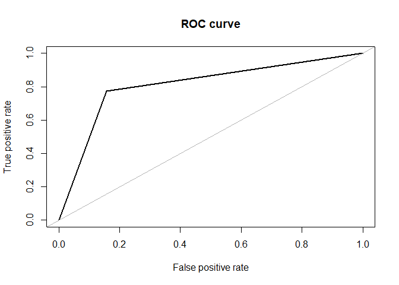<!-- -->

    ## [[1]]
    ## Area under the curve (AUC): 0.809
    ## 
    ## [[2]]
    ## Confusion Matrix and Statistics
    ## 
    ##             
    ## rf.pred.tree    0    1
    ##            0 1292  318
    ##            1  240 1095
    ##                                           
    ##                Accuracy : 0.8105          
    ##                  95% CI : (0.7959, 0.8245)
    ##     No Information Rate : 0.5202          
    ##     P-Value [Acc > NIR] : < 2.2e-16       
    ##                                           
    ##                   Kappa : 0.6196          
    ##                                           
    ##  Mcnemar's Test P-Value : 0.001115        
    ##                                           
    ##             Sensitivity : 0.8433          
    ##             Specificity : 0.7749          
    ##          Pos Pred Value : 0.8025          
    ##          Neg Pred Value : 0.8202          
    ##              Prevalence : 0.5202          
    ##          Detection Rate : 0.4387          
    ##    Detection Prevalence : 0.5467          
    ##       Balanced Accuracy : 0.8091          
    ##                                           
    ##        'Positive' Class : 0               
    ## 

``` r
rf_train(data_under)
```

<!-- -->

    ## [[1]]
    ## Area under the curve (AUC): 0.798
    ## 
    ## [[2]]
    ## Confusion Matrix and Statistics
    ## 
    ##             
    ## rf.pred.tree   0   1
    ##            0 375 110
    ##            1  70 335
    ##                                           
    ##                Accuracy : 0.7978          
    ##                  95% CI : (0.7698, 0.8237)
    ##     No Information Rate : 0.5             
    ##     P-Value [Acc > NIR] : < 2e-16         
    ##                                           
    ##                   Kappa : 0.5955          
    ##                                           
    ##  Mcnemar's Test P-Value : 0.00365         
    ##                                           
    ##             Sensitivity : 0.8427          
    ##             Specificity : 0.7528          
    ##          Pos Pred Value : 0.7732          
    ##          Neg Pred Value : 0.8272          
    ##              Prevalence : 0.5000          
    ##          Detection Rate : 0.4213          
    ##    Detection Prevalence : 0.5449          
    ##       Balanced Accuracy : 0.7978          
    ##                                           
    ##        'Positive' Class : 0               
    ## 

``` r
rf_test(train.set)
```

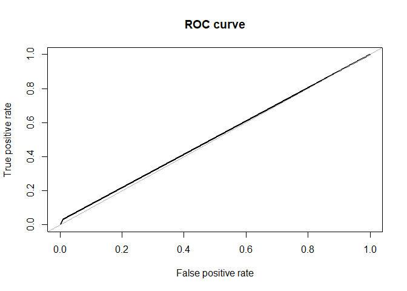<!-- -->

    ## [[1]]
    ## Area under the curve (AUC): 0.511
    ## 
    ## [[2]]
    ## Confusion Matrix and Statistics
    ## 
    ##             
    ## rf.pred.tree   0   1
    ##            0 670 123
    ##            1   7   4
    ##                                          
    ##                Accuracy : 0.8383         
    ##                  95% CI : (0.811, 0.8631)
    ##     No Information Rate : 0.842          
    ##     P-Value [Acc > NIR] : 0.6361         
    ##                                          
    ##                   Kappa : 0.0336         
    ##                                          
    ##  Mcnemar's Test P-Value : <2e-16         
    ##                                          
    ##             Sensitivity : 0.9897         
    ##             Specificity : 0.0315         
    ##          Pos Pred Value : 0.8449         
    ##          Neg Pred Value : 0.3636         
    ##              Prevalence : 0.8420         
    ##          Detection Rate : 0.8333         
    ##    Detection Prevalence : 0.9863         
    ##       Balanced Accuracy : 0.5106         
    ##                                          
    ##        'Positive' Class : 0              
    ## 

``` r
rf_test(data_over)
```

<!-- -->

    ## [[1]]
    ## Area under the curve (AUC): 0.681
    ## 
    ## [[2]]
    ## Confusion Matrix and Statistics
    ## 
    ##             
    ## rf.pred.tree   0   1
    ##            0 522  52
    ##            1 155  75
    ##                                           
    ##                Accuracy : 0.7425          
    ##                  95% CI : (0.7108, 0.7724)
    ##     No Information Rate : 0.842           
    ##     P-Value [Acc > NIR] : 1               
    ##                                           
    ##                   Kappa : 0.272           
    ##                                           
    ##  Mcnemar's Test P-Value : 1.346e-12       
    ##                                           
    ##             Sensitivity : 0.7710          
    ##             Specificity : 0.5906          
    ##          Pos Pred Value : 0.9094          
    ##          Neg Pred Value : 0.3261          
    ##              Prevalence : 0.8420          
    ##          Detection Rate : 0.6493          
    ##    Detection Prevalence : 0.7139          
    ##       Balanced Accuracy : 0.6808          
    ##                                           
    ##        'Positive' Class : 0               
    ## 

``` r
rf_test(data_both)
```

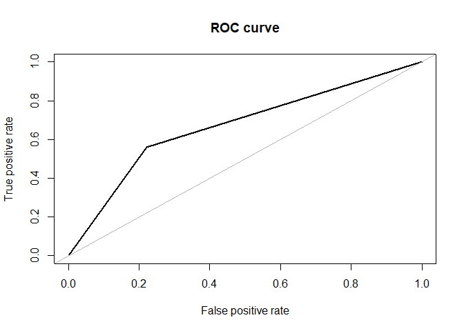<!-- -->

    ## [[1]]
    ## Area under the curve (AUC): 0.669
    ## 
    ## [[2]]
    ## Confusion Matrix and Statistics
    ## 
    ##             
    ## rf.pred.tree   0   1
    ##            0 527  56
    ##            1 150  71
    ##                                           
    ##                Accuracy : 0.7438          
    ##                  95% CI : (0.7121, 0.7736)
    ##     No Information Rate : 0.842           
    ##     P-Value [Acc > NIR] : 1               
    ##                                           
    ##                   Kappa : 0.2595          
    ##                                           
    ##  Mcnemar's Test P-Value : 9.196e-11       
    ##                                           
    ##             Sensitivity : 0.7784          
    ##             Specificity : 0.5591          
    ##          Pos Pred Value : 0.9039          
    ##          Neg Pred Value : 0.3213          
    ##              Prevalence : 0.8420          
    ##          Detection Rate : 0.6555          
    ##    Detection Prevalence : 0.7251          
    ##       Balanced Accuracy : 0.6687          
    ##                                           
    ##        'Positive' Class : 0               
    ## 

``` r
rf_test(data_under)
```

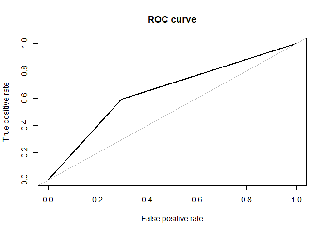<!-- -->

    ## [[1]]
    ## Area under the curve (AUC): 0.648
    ## 
    ## [[2]]
    ## Confusion Matrix and Statistics
    ## 
    ##             
    ## rf.pred.tree   0   1
    ##            0 477  52
    ##            1 200  75
    ##                                           
    ##                Accuracy : 0.6866          
    ##                  95% CI : (0.6532, 0.7185)
    ##     No Information Rate : 0.842           
    ##     P-Value [Acc > NIR] : 1               
    ##                                           
    ##                   Kappa : 0.2003          
    ##                                           
    ##  Mcnemar's Test P-Value : <2e-16          
    ##                                           
    ##             Sensitivity : 0.7046          
    ##             Specificity : 0.5906          
    ##          Pos Pred Value : 0.9017          
    ##          Neg Pred Value : 0.2727          
    ##              Prevalence : 0.8420          
    ##          Detection Rate : 0.5933          
    ##    Detection Prevalence : 0.6580          
    ##       Balanced Accuracy : 0.6476          
    ##                                           
    ##        'Positive' Class : 0               
    ## 

``` r
rf = randomForest(TenYearCHD~.,ntree = 1000,data = data_both)
varImpPlot(rf)#Variable importance plot
```

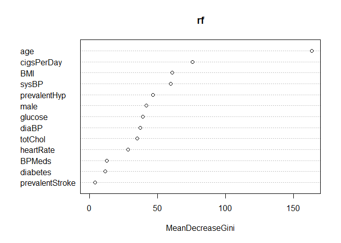<!-- -->

The best random forest model is the model built on oversampled training
dataset with test accuracy of 74%. Sensitivity of the model is 77% and
specificity of the model is 59%.AUC is 68%.

The variable importance plot of random forest gives us the most
influencing predictors.  
The important predictors influencing the development of ten-year CHD are
age, cigarettes per day, systolic BP, BMI, gender and prevalent
hypertension.
